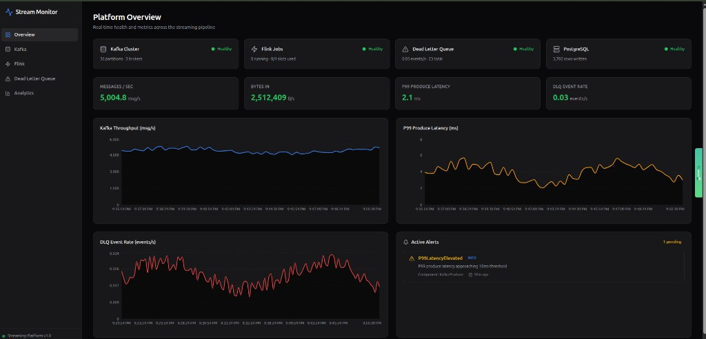

# Distributed Event Streaming Platform

[](https://github.com/Kelvinoppong/Distributed-Event-Streaming-Platform/actions/workflows/ci.yml)
[](https://github.com/Kelvinoppong/Distributed-Event-Streaming-Platform/actions/workflows/docker.yml)

A production-grade real-time event streaming pipeline that ingests high-throughput e-commerce order events, processes them with exactly-once semantics through stateful stream computations, and persists windowed aggregations to PostgreSQL. Failed events are routed to a dead letter queue with exponential retry and Slack alerting. The entire stack is Kubernetes-native with autoscaling, pod disruption budgets, and full observability.



## How It Works

1. **Go producers** generate order events at configurable rates (default 400 events/sec across 4 workers) and publish them to Kafka with idempotent delivery (`acks=all`). Events are keyed by `userId` for partition-level ordering.

2. **Kafka cluster** (3 brokers, KRaft consensus) receives events into a 12-partition topic with replication factor 3 and `min.insync.replicas=2`, guaranteeing no data loss on broker failure.

3. **Apache Flink** consumes from Kafka using the CooperativeStickyAssignor, validates each event, and routes invalid messages (negative amounts, empty IDs) to a DLQ topic via side outputs. Valid events pass through bounded out-of-order watermarking (5s tolerance) into 1-minute tumbling window aggregations keyed by user.

4. **PostgreSQL sink** receives windowed results via JDBC batch upserts (`ON CONFLICT DO UPDATE`), completing the exactly-once chain from producer through processing to storage.

5. **Dead Letter Queue pipeline** handles failures in two ways: a Go retry consumer re-publishes events with exponential backoff (1s→2s→4s→8s→16s), and a Kafka Connect connector with a custom SMT posts alerts to Slack for permanent failures.

6. **Observability stack** — Prometheus scrapes JMX metrics from Kafka and Flink every 15s; Grafana renders dashboards for throughput, P99 latency, DLQ rate, and checkpoint duration; alerting rules fire on under-replicated partitions, high latency, and DLQ anomalies.

7. **Monitoring dashboard** (Next.js) provides a unified real-time view of the entire pipeline — cluster health, metrics, alerts, and order analytics — in a single UI.

## Architecture

```
┌────────────────┐     ┌────────────────────────────┐     ┌──────────────────┐
│ Go Producer(s) │────►│ Kafka Cluster (3 brokers)  │────►│  Apache Flink    │
│ idempotent     │     │ KRaft · RF=3 · 12 parts    │     │  RocksDB · E2E   │
└────────────────┘     └────────────────────────────┘     └────────┬─────────┘
                                                                   │
                                                      ┌────────────┴────────────┐
                                                      ▼                         ▼
                                             ┌────────────────┐       ┌─────────────────┐
                                             │  PostgreSQL    │       │  DLQ Topic       │
                                             │  JDBC upsert   │       │  order-events-dlq│
                                             └────────────────┘       └────────┬────────┘
                                                                               │
                                                                  ┌────────────┴───────────┐
                                                                  ▼                        ▼
                                                         ┌─────────────────┐     ┌──────────────────┐
                                                         │ Retry Consumer  │     │ Kafka Connect     │
                                                         │ exp backoff     │     │ + Slack SMT       │
                                                         └─────────────────┘     └──────────────────┘
```

## Tech Stack

| Component | Technology |
|-----------|------------|
| Message Broker | Apache Kafka 3.6 (Strimzi on K8s / KRaft local) |
| Stream Processing | Apache Flink 1.18 (K8s Operator) |
| State Backend | RocksDB with exactly-once checkpointing |
| Producer | Go 1.21 + IBM/Sarama (idempotent) |
| Sink Database | PostgreSQL 16 (upsert semantics) |
| DLQ Retry | Go consumer + exponential backoff |
| DLQ Alerts | Kafka Connect + custom Slack SMT |
| Orchestration | Kubernetes + Helm |
| Autoscaling | HPA (2–20 pods) + PDB |
| Metrics | Prometheus + JMX Exporter |
| Dashboards | Grafana + Next.js 14 monitoring UI |
| Load Testing | k6 + xk6-kafka |
| CI/CD | GitHub Actions (build, test, Docker publish) |

## Quick Start

### Prerequisites

- Docker and Docker Compose v2
- Go 1.21+ (producer / DLQ consumer)
- Java 17 + Maven 3.9+ (Flink jobs)

### Launch Infrastructure

```bash
cp .env.example .env
chmod +x scripts/setup-local.sh
./scripts/setup-local.sh
```

### Build and Run the Pipeline

```bash
cd flink-jobs && mvn clean package -DskipTests
docker compose exec flink-jobmanager flink run /opt/flink/usrlib/order-event-processor-1.0.0.jar
cd ../producer && go mod tidy && go run .
```

### Start the Monitoring Dashboard

```bash
docker compose --profile web up -d
```

### Service URLs

| Service | URL |
|---------|-----|
| Stream Monitor (Dashboard) | http://localhost:3001 |
| Kafka UI | http://localhost:8080 |
| Flink Dashboard | http://localhost:8081 |
| Grafana | http://localhost:3000 (admin / streaming) |
| Prometheus | http://localhost:9090 |
| PostgreSQL | `localhost:5432` (streaming / streaming) |

## Dashboard Pages

- **Overview** — Cluster health, throughput, P99 latency, DLQ rate, active alerts
- **Kafka** — Per-broker metrics, partition health, throughput time series
- **Flink** — Job status, checkpoint duration, task slot utilization
- **Dead Letter Queue** — DLQ event rate, cumulative counts, retry status
- **Analytics** — Top users, revenue/volume time series from PostgreSQL

## Kubernetes Deployment

```bash
# Kind cluster with 3 workers (simulates 3 AZs)
chmod +x scripts/deploy-k8s.sh
./scripts/deploy-k8s.sh

# Or via Helm
helm install streaming-platform ./helm/streaming-platform \
  --namespace streaming --create-namespace
```

**Key K8s features:**
- HPA scales producers 2–20 replicas on CPU/memory thresholds
- PDBs ensure zero-downtime rolling upgrades (min 2 producers available, max 1 Kafka broker unavailable)
- Pod anti-affinity spreads Kafka brokers across nodes
- Strimzi and Flink Operators manage lifecycle declaratively via CRDs

## Exactly-Once Guarantees

The pipeline achieves end-to-end exactly-once delivery through three mechanisms:
1. **Producer** — Sarama idempotent mode (`enable.idempotence=true`, `acks=all`)
2. **Processing** — Flink `EXACTLY_ONCE` checkpointing with RocksDB state backend
3. **Sink** — PostgreSQL `ON CONFLICT ... DO UPDATE` upsert on `(user_id, window_start)`

## Load Testing

```bash
./scripts/run-load-test.sh          # Default: ramp to 1,000 VUs over 10 min
./scripts/run-load-test.sh stress   # Stress: ramp to 5,000 VUs over 12 min
```

| Profile | Peak VUs | Duration | Purpose |
|---------|----------|----------|---------|
| `low` | 10 | 1 min | Smoke test |
| `default` | 1,000 | 10 min | Standard benchmark |
| `high` | 2,000 | 9 min | Sustained high throughput |
| `stress` | 5,000 | 12 min | Break point analysis |

## Configuration

| Variable | Default | Description |
|----------|---------|-------------|
| `KAFKA_BROKERS` | `localhost:29092,...` | Kafka bootstrap servers |
| `KAFKA_TOPIC` | `order-events` | Target topic |
| `NUM_WORKERS` | `4` | Producer goroutines |
| `EVENTS_PER_SECOND` | `100` | Events/sec per worker |
| `MAX_RETRIES` | `5` | DLQ retry attempts |
| `BASE_BACKOFF_SECONDS` | `1` | Initial retry backoff |
| `SLACK_WEBHOOK_URL` | _(empty)_ | Slack webhook for DLQ alerts |

## Project Structure

```
├── producer/                  # Go event producer (idempotent, HPA-ready)
├── flink-jobs/                # Flink stream processing (validation, windowing, sinks)
├── dlq-retry-consumer/        # Go DLQ retry service (exponential backoff)
├── kafka-connect/             # Kafka Connect + custom Slack alert SMT
├── web/                       # Next.js real-time monitoring dashboard
├── k8s/                       # Kubernetes manifests (Kafka, Flink, producer, monitoring)
├── helm/streaming-platform/   # Helm chart for parameterized deployment
├── monitoring/                # Prometheus config, alert rules, Grafana provisioning
├── load-test/                 # k6 load test scripts + profiles
├── scripts/                   # Setup, deploy, and test automation
├── docs/                      # Architecture and benchmark documentation
└── .github/workflows/         # CI/CD pipelines
```

## Documentation

- [Architecture](docs/architecture.md) — Detailed component design, data flow, and deployment strategy
- [Benchmarks](docs/benchmarks.md) — Load test results and performance analysis

## License

MIT
